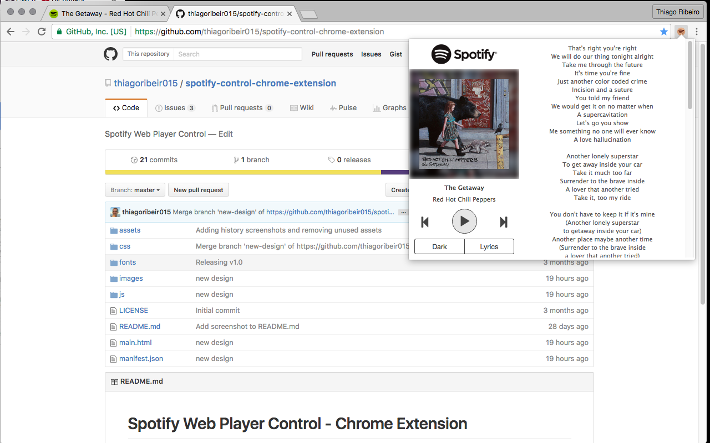

# Spotify Web Player Control - Chrome Extension

<a target="_blank" href="http://chrome.google.com/webstore/detail/spotify-web-player-contro/cgmcneemfjgkibalfalgjgmfnajkmopd/"></img></a>

Control your current Spotify Web Player without looking for the right tab. Use the extension to Play/Pause/Previous/Next your current playlist.

## Installation

Clone the project and just load the project folder into the chrome extensions tab. 

## Small Print

### License

`Spotify Web Player Control` is released under the Apache-2.0 license.

### Dependencies

* Bootstrap v3.3.5 (http://getbootstrap.com)

### Author

* Thiago Ribeiro ([@thiagoribeir015](http://twitter.com/thiagoribeir015))

### Contributors
 
* Leonardo Luiz (https://github.com/leonardokl)
* Emerson Laurentino (https://github.com/emersonlaurentino)
* Special thanks to Francois Beaufort (https://github.com/beaufortfrancois) for project inspiration.